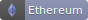

#  PrivacyPopUpBlock
Cross browser extension to block annoying privacy popups

___

# How does it work?
This extension has a block-list of CSS rules that target privacy pop ups. As soon as a webpage loads, the extension deploys special CSS rules to give you back the control of the webpage, by removing any privacy pop up modal or notification.

___

# Credit
- [Font Awesome](http://fontawesome.io/) icons
- [MinerBlock](https://github.com/xd4rker/MinerBlock/) (based on its source code)

___

# Donations
All donations are welcome and greatly appreciated.

___

### Contact me

Contact me to leave me your feedback or to express your thoughts.

You can [open an issue](https://github.com/GramThanos/PrivacyPopUpBlock/issues) or [send me a mail](mailto:gramthanos@gmail.com)

___

### License

This project is under [The MIT license](https://opensource.org/licenses/MIT).
I do although appreciate attribute.

Copyright (c) 2020 Grammatopoulos Athanasios-Vasileios

___

